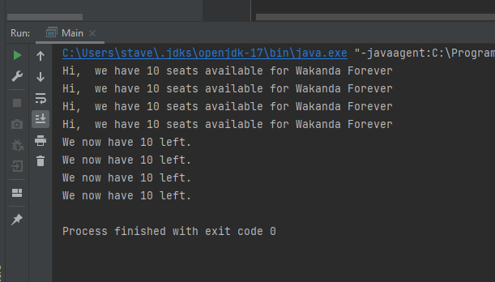

# SimpleMovieTicketBookingApplication
Assignment 2 OS

This is the result in the console after running the main-method before changing code. I assume its because all threads are run at the same time, 
and as a result the number of available tickets are not deducted after each other. The value is still the first value, which is a shared variable. We want it to first be 10, then deducted the amount of tickets wanted. 
 
This shows there are no inter-thread communication. To enable this communication, we need to use the await() and notify()-methods. 

I cant get it right at this time, but I have understood the theory behind the multithreading-consept. 